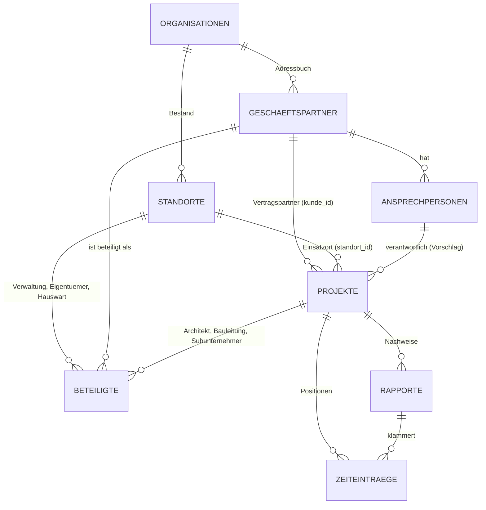

# Datenmodell: Standorte und Beteiligte

Arbeitsstand vom 21.08.2026 · **Gabelung entschieden, nichts gebaut**

Entstanden aus Gesprächen mit Interessenten (IT-Dienstleistung und Handwerk)
und aus der Frage, ob ArcoTime zwischen Kunde und Projekt eine Ebene fehlt.
Die Fragen aus Abschnitt 6 sind am 21.08.2026 mit einem Handwerksbetrieb
besprochen (Würth und Partner AG, Markus Hermann) — die Antworten und der
daraus folgende Entscheid stehen in **Abschnitt 7**. Abschnitte 3 und 5 sind
damit teilweise überholt; sie bleiben stehen, weil die Begründung des Irrwegs
zum Verständnis gehört.

---

## 1. Wo ArcoTime heute steht

```
kunden 1 ─── n projekte 1 ─── n zeiteinträge
                        └───── n rapporte      (rapporte.projekt_id ist NULL-fähig,
                                                rapporte.kunde_id ist Pflicht)
```

Nachgeprüft am 21.08.2026 gegen Schema und Daten:

- `projekte.kunde_id` Pflicht (`on delete cascade`), `zeiteintraege.projekt_id`
  Pflicht (`on delete restrict`).
- `rapporte.kunde_id` Pflicht, `rapporte.projekt_id` **optional** — der
  Rapport hängt in der Datenbank am Kunden, nicht am Projekt. Dass es sich
  anders anfühlt, liegt an einer Prüfung in `erstelleRapport()`.
  → **Zwei Wege zum Kunden**, nur von der Anwendung zusammengehalten.
  13 Rapporte, 2 davon ohne Projekt (beide leer, vom 15.08., vor der Prüfung).
  28 Rapportpositionen geprüft: keine Abweichung.
- **Keine Adressfelder** an `projekte` oder `rapporte`. Das Rapport-PDF druckt
  die Adresse des Kunden (`rapport-dokument-daten.ts`).
- `kunden.anreise_km` — 0050 begründet das ausdrücklich damit, die Distanz zu
  einem Kunden sei „eine Eigenschaft dieses Kunden und ändert sich nie".
- Keine Ansprechpersonen. `kunden.email`/`telefon` ist eine Firmenadresse,
  `rapporte.unterzeichner_name` ist Freitext.

## 2. Was die Gespräche zeigen

**Der IT-Dienstleister hat dieselbe Struktur wie der Handwerker.** Migros
Region Basel ist Kunde und Vertragspartner mit einer Adresse; gearbeitet wird
in den einzelnen Filialen — eigene Adresse, abweichende Anreise, eigene
Ansprechpersonen. Beim Maler heisst dasselbe Liegenschaft.

Damit ist die Ebene **nicht branchenspezifisch**, und die Unterscheidung
Projekt/Objekt ist zu einem guten Teil eine Frage der Beschriftung
(Standort · Filiale · Liegenschaft · Objekt · Anlage).

**Neu und schwerer: es gibt mehr Parteien als Kunde und Ansprechperson.**

- Die Liegenschaftsverwaltung ist Kunde, die Liegenschaft gehört einem
  **Eigentümer**. Organisatorisches wird mit ihm geklärt, und **gewisse Belege
  müssen an ihn adressiert** werden.
- Dieselbe Verwaltung arbeitet für verschiedene Eigentümer mit demselben
  Maler — er muss auseinanderhalten, welche Liegenschaft wem gehört.
- Bei grösseren Vorhaben kommen **Architekt, Bauleitung, Subunternehmer**
  dazu.
- Beim Dienstleister gibt es dasselbe Muster (Generalunternehmer,
  Systemlieferant, Hausdienst).

Das ist eine **zweite Achse**, nicht eine weitere Stufe: Die Kette
Kunde → Standort → Projekt beschreibt *wo* gearbeitet wird; die Beteiligten
beschreiben *wer mitredet* und *wer welchen Beleg bekommt*.

## 3. Entwurf (erster Anlauf — in zwei Punkten überholt, siehe Abschnitt 7)

> **Überholt:** `projekte.kunde_id` entfällt **nicht** (Antwort 2), und der
> Standort gehört **nicht** dem Kunden (Antwort 5). Der gültige Entwurf steht
> in Abschnitt 7.4.

```
kunden ─────────────────── 1:n ── standorte ── 1:n ── ansprechpersonen
 (Geschäftspartner,                 │
  Rolle „Kunde")                    └── 1:n ── projekte ── 1:n ── rapporte
                                                        └── 1:n ── zeiteinträge

beteiligte  (rolle + Verweis)
   an standorte  →  Eigentümer, Verwaltung, Hauswart
   an projekte   →  Architekt, Bauleitung, Subunternehmer
   an Belegen    →  abweichender Adressat
```

**Kern des Vorschlags: die Standortebene ist immer da, sichtbar ist sie nur,
wer sie braucht.**

- `projekte.standort_id` **NOT NULL**, `projekte.kunde_id` **entfällt**
  (abgeleitet über den Standort). Ein Weg zum Besitzer, schemagarantiert.
- Beim Anlegen eines Kunden entsteht automatisch ein **Standardstandort** mit
  Name und Adresse des Kunden. Das Projektformular zeigt das Feld nicht.
  Wer keine Standorte kennt, sieht `Kunde → Projekt` wie heute — kein Klick
  mehr, keine Erklärung.
- Wer sie braucht, schaltet die Ebene in den Einstellungen ein: Feld
  erscheint, Standardstandort umbenennbar, weitere anlegbar. **Ohne
  Datenmigration**, weil die Daten schon richtig liegen.
- `ansprechpersonen.standort_id` **NOT NULL** — der Standardstandort trägt die
  Kontakte der Zentrale. Wieder ein Weg: Person → Standort → Kunde. Keine
  Redundanz, kein nullable Mittelglied.
- **Warum die mittlere Ebene die implizite ist:** Am Projekt hängen
  `naechste_belegnummer` (0005), `kostenstelle`, `belege_exporte.projekt_id`
  und die Mitarbeiterzuweisung bei eingeschränkter Sichtbarkeit; und
  `zeiteintraege.projekt_id` ist Pflicht. Das Projekt kann nicht verschwinden,
  der Standort kann implizit sein.

**Was an den Standort gehört:** Adresse, `anreise_km` (heute am Kunden),
Zugang/Schlüssel/Hauswart, Notiz — und damit die Einsatzadresse auf dem
Rapport und die Historie über Jahre und Aufträge hinweg.

**Beschriftungen** kommen in eine kleine Tabelle `begriffe` je Organisation
(Schlüssel, Einzahl, Mehrzahl — die Mehrzahl lässt sich im Deutschen nicht
ableiten: Objekt/Objekte, aber Auftrag/Aufträge). Gleiches Muster wie die
konfigurierbaren Auswahllisten (0014). Gilt nicht nur hier: Der
IT-Dienstleister sagt Ticket statt Anfrage, mancher sagt Serviceschein statt
Rapport.

## 4. Wie die Beteiligten gebaut werden — und was das mit `kunden` macht

Ein Eigentümer braucht genau die Felder, die ein Kunde hat: Adresse, Anrede,
Sprache, später eine UID. Eine zweite Firmentabelle wäre die schlechtere
Verdoppelung. Vorschlag: **`kunden` ist schon heute eine
Geschäftspartner-Tabelle** (Anrede, Vorname, Name = „Nachname oder
Firmenname", Adresse, Währung, Zahlungskondition, `adress_schluessel` für den
Export) — sie bekommt Rollenkennzeichen, und die Listen filtern darauf. Der
Tabellenname bleibt; ihn zu ändern wäre kosmetisch und teuer (die
Umbenennung `mandate → projekte` in 0008 zeigt den Umfang).

**Personen bleiben eine eigene Tabelle.** Nicht wegen RLS — eine
selbstbezügliche Hierarchie mit `organisation_id` an jeder Zeile bräuchte
keinen rekursiven Policy-Ausdruck; mein Einwand vom 18.08. war da zu breit.
Der belastbare Grund ist die Integrität: Auf `kunden` zeigen heute
`projekte`, `rapporte`, `anfragen`, `kundenpreise`, `kundenrabatte` und mehr.
Lägen Personen in derselben Tabelle, könnte jeder dieser Fremdschlüssel
versehentlich auf eine Person zeigen, und **kein Check kann ausdrücken
„dieser Fremdschlüssel muss auf eine Zeile mit Rolle X zeigen"**. Zwei
Tabellen können das, weil der Fremdschlüssel selbst die Aussage trifft.

## 5. Die Gabelung, die alles entscheidet — **entschieden: B**

**Gehört ein Standort einem Kunden — oder ist er eine eigene Sache, an der
Parteien mit Rollen hängen?**

- **A: Standort gehört dem Kunden** (`standorte.kunde_id NOT NULL`). Einfach,
  ein Weg, passt zu Migros/Filiale. Aber: Wechselt eine Liegenschaft die
  Verwaltung, entsteht ein zweiter Standort — und die Historie zerfällt.
- **B: Standort ist eigenständig**, Verwaltung und Eigentümer sind Rollen mit
  Gültigkeitszeitraum. Die Historie hält über Verwaltungswechsel hinweg. Aber:
  Der Besitzerpfad zur Organisation läuft dann nicht mehr über den Kunden,
  jede Liste braucht die Frage „welcher Standort gehört gerade zu wem", und
  Export und Löschung müssen anders gedacht werden.

Beides ist verteidigbar. Die Antwort hängt daran, wie oft ein
Verwaltungswechsel real vorkommt und ob die Historie ihn überleben muss —
deshalb Frage 5 unten.

**Entschieden am 21.08.2026: B.** Zwei Antworten führen dorthin, nicht eine —
siehe Abschnitt 7.

## 6. Fragen für die Gespräche mit den Handwerkern

**Zur Struktur**

1. Führst du pro Liegenschaft **mehrere Aufträge** getrennt, oder ist die
   Liegenschaft der Auftrag? (Entscheidet, ob die Projektebene für ihn
   sichtbar sein muss.)
2. Wer ist dein **Vertragspartner** — die Verwaltung oder der Eigentümer?
   Und wer bekommt die **Rechnung**: immer derselbe, oder je Auftrag
   verschieden?
3. Muss ein Beleg an den Eigentümer **adressiert** werden können, oder
   brauchst du ihn nur als Information? (Entscheidet, ob Beteiligte
   belegfähig sein müssen — mit Adresse, Anrede, allem.)
4. Wie viele Beteiligte sind bei einem grösseren Vorhaben real im Spiel, und
   willst du deren Kontaktdaten **in ArcoTime** pflegen — oder stehen die
   ohnehin im Bauleitungsprotokoll?
5. **Wechselt eine Liegenschaft die Verwaltung oder den Eigentümer?** Wenn ja:
   Willst du die Historie der Liegenschaft danach weiter sehen? (Das ist die
   Gabelung aus Abschnitt 5.)

**Zum Alltag**

6. Gehören die **Anfahrtskilometer** zur Liegenschaft oder zum Kunden? Oder
   verrechnest du eine Pauschale je Auftrag?
7. Wer **unterschreibt** den Rapport vor Ort — Hauswart, Mieter, Verwaltung?
   Willst du diese Personen im System pflegen, oder wird der Name jedes Mal
   getippt?
8. Was suchst du in der **Historie** einer Liegenschaft: erbrachte Leistungen,
   verwendetes Material (Farbtöne!), Fotos, oder die Belege?
9. Adressiert du Post je nach Anlass an verschiedene Personen desselben
   Kunden? (Angebot an die Verwaltung, Rapport an den Hauswart, Rechnung an
   den Eigentümer?)

**Zur Abgrenzung**

10. Gibt es beim Mieter noch eine Ebene (Wohnung, Stockwerk), oder genügt die
    Liegenschaft mit einer Notiz auf dem Rapport?

## 7. Die Antworten vom 21.08.2026 — und was daraus folgt

Gespräch mit **Würth und Partner AG**, Markus Hermann. Die Antworten wörtlich,
darunter jeweils die Folge fürs Datenmodell.

### 7.1 Was er gesagt hat

**1. Aufträge je Liegenschaft** — „mehrere Aufträge pro Liegenschaft"
→ Die Auftragsebene bleibt sichtbar. Drei Ebenen: Kunde · Liegenschaft ·
Auftrag. Der Standort ersetzt das Projekt nicht, er steht darüber.

**2. Vertragspartner und Rechnung** — „Das ist unterschiedlich und beides ist
möglich. Die Rechnungsadresse ist ebenso unterschiedlich."
→ **Der wichtigste Satz des Gesprächs.** Der Vertragspartner wird *je Auftrag*
bestimmt, nicht von der Liegenschaft. Dieselbe Liegenschaft kann einen Auftrag
mit der Verwaltung und einen mit dem Eigentümer haben.

**3. Beleg an den Eigentümer** — „Ja, oft ist es so, dass die Rechnung von der
Verwaltung bezahlt wird, aber der Eigentümer für die Steuererklärung eine
Rechnung an ihn wünscht."
→ Beteiligte müssen **belegfähig** sein: volle Adresse, Anrede, alles. Und:
**Rechnungsempfänger und Zahler sind zwei verschiedene Rollen** (der
Eigentümer schuldet und zieht ab, die Verwaltung bezahlt). Genau die
Trennung, die Comatic als `Rechnungsadresse` / `Zustelladresse` am Beleg führt.

**4. Beteiligte pflegen** — „Das wäre wünschenswert, weil je nach Baustelle
viele unterschiedliche Kontaktpersonen im Spiel sind und die gleichen wiederum
in anderen Projekten auch."
→ Bestätigt Abschnitt 8 wörtlich: ein Adressbuch je Mandant, Verknüpfung statt
Kopie. Der Satz „die gleichen wiederum in anderen Projekten" ist genau das
Problem, das die zehn Kopien erzeugt.

**5. Wechsel von Verwaltung/Eigentümer** — „Das wäre eine super Option"
→ Die Historie soll den Wechsel überleben. **Option B.**

**6. Anfahrtskilometer** — „Wir verrechnen immer die km zur Liegenschaft, wo
gearbeitet wird."
→ `anreise_km` wandert vom Kunden an den Standort. Die Begründung in 0050
(„die Distanz zu einem Kunden … ändert sich nie") ist für diesen Fall
widerlegt und gehört im Kommentar korrigiert.

**7. Unterschrift** — „In der Regel gibt es pro Auftrag eine verantwortliche
Person; wenn die im Auftrag steht und vorgeschlagen wird, wäre das gut, muss
aber geändert werden können."
→ Eine verantwortliche Person **je Auftrag** als Vorschlag für die
Unterschrift, überschreibbar. Der Freitext am Rapport bleibt.

**8. Historie** — „Je mehr Infos abgelegt werden können, je besser"
→ Keine Einschränkung. Die Standortseite wird eine Sammelansicht über
Aufträge, Rapporte, Dokumente und später Material. Braucht den
Dokumentbereich `standort`.

**9. Adressat je Dokument** — „Genau, ein wichtiger Punkt: ich muss pro
Dokument sagen können, an welche Adresse es geht."
→ Jedes Dokument bekommt einen **Adressaten** (Partner + optional
Ansprechperson), beim Versand eingefroren.

**10. Ebene unter der Liegenschaft** — „Notiz auf dem Rapport genügt."
→ Kein Wohnung/Stockwerk. **Eine Abgrenzung gewonnen.**

### 7.2 Zwei Korrekturen an meinem Entwurf

**`projekte.kunde_id` bleibt.** Ich wollte die Spalte streichen und den Kunden
über den Standort ableiten. Antwort 2 widerlegt das: Der Vertragspartner
gehört zum *Auftrag*, nicht zur Liegenschaft. Kunde und Standort am Projekt
sind **keine** zwei Wege zur selben Aussage — sie sagen Verschiedenes: *wer
bestellt und schuldet* und *wo gearbeitet wird*. Beide bleiben Pflicht.

**Der Standort gehört dem Mandanten, nicht dem Kunden.** Aus Antwort 5 folgt
`standorte.organisation_id NOT NULL` **ohne** `kunde_id`. Die Liegenschaft ist
ein Eintrag im Bestand des Malers; Verwaltung und Eigentümer hängen als
**Beteiligte mit Gültigkeitszeitraum** daran. Nur so überlebt die Historie den
Wechsel — und nur so passt Antwort 2, wo dieselbe Liegenschaft Aufträge
verschiedener Vertragspartner trägt.

Was von der Redundanzkritik bleibt: **`rapporte.kunde_id` verschwindet**. Die
ist eine echte zweite Wahrheit (der Rapport hängt am Auftrag, der Auftrag kennt
den Kunden).

### 7.3 Der Standardstandort trägt weiterhin

Für den Dienstleister ohne Standortdenken bleibt es beim automatischen
Standardstandort: Beim Anlegen eines Kunden entsteht ein Standort mit dessen
Name und Adresse, verknüpft über die Beteiligtenrolle „Kunde". Das
Auftragsformular zeigt das Feld nicht und füllt es still. Er sieht
`Kunde → Auftrag` wie heute.

### 7.4 Der gültige Entwurf



Die tragenden Regeln:

| Regel | Warum |
|---|---|
| `standorte.organisation_id` **NOT NULL**, kein `kunde_id` | Historie überlebt den Verwaltungswechsel (Antwort 5) |
| `projekte.kunde_id` **NOT NULL** | Vertragspartner je Auftrag (Antwort 2) |
| `projekte.standort_id` **NOT NULL** | Einsatzort, Anreise, Historie (Antworten 1, 6) |
| `rapporte.kunde_id` **entfällt** | echte Redundanz — der Auftrag kennt den Kunden |
| `beteiligte` mit `gueltig_von`/`gueltig_bis` | Wechsel von Verwaltung und Eigentümer |
| `beteiligte` mit echten Fremdschlüsseln je Bezugsart + `num_nonnulls`-Check | nicht polymorph wie `dokumente` — siehe Abschnitt 8 |
| `anreise_km` am **Standort** | Antwort 6 |
| Dokumente/Belege mit **Adressat**, beim Versand eingefroren | Antwort 9 |
| Kein Wohnung/Stockwerk | Antwort 10 |

### 7.5 Neue offene Fragen aus den Antworten

1. **Zu Antwort 3:** Ist die Rechnung an den Eigentümer ein **zweites
   Dokument** oder dieselbe Rechnung mit anderem Adressaten? Zweimal die
   gleiche Leistung fakturieren wäre MWST-seitig heikel; eine Zweitausfertigung
   an einen anderen Adressaten ist unproblematisch. **Fachliche Frage.**
2. **Zu Antwort 2:** Darf ein Auftrag den Vertragspartner nachträglich
   wechseln? Preise und Rabatte sind je Position eingefroren — ein Wechsel
   danach wäre erklärungsbedürftig.
3. **Zu Antwort 5:** Braucht der Wechsel ein **Datum** (von/bis) oder genügt
   „aktuell" plus eine Liste der früheren? Ein Datum ist billig jetzt und
   teuer später.
4. **Zu Antwort 7:** Ist die verantwortliche Person eine des Kunden oder eine
   des Standorts (Hauswart)? Vermutlich beides — dann muss das Feld jede
   Ansprechperson eines Beteiligten dieses Auftrags oder Standorts zulassen.
5. **Das zweite Gespräch** stand noch aus. Ein zweiter Betrieb, der Antwort 5
   anders beantwortet, wäre wichtig zu wissen, **bevor** wir bauen.

---

## 8. Fremde Adressen, die überall vorkommen

Aus der Praxis des Nutzers, und in den meisten Lösungen ungelöst: In den
Projekten tauchen ständig **fremde Adressen** auf — Architekt, Bauleitung, der
Elektriker, mit dem sich der IT-Dienstleister wegen der Netzwerkverkabelung
koordinieren muss, Behörden, Ämter. Dieselben Adressen kommen bei vielen
Kunden und Projekten wieder vor: Ein Architekt arbeitet für viele Verwaltungen
und Eigentümer.

Üblicherweise wird er dann zehnmal vollständig erfasst. Bei einem Umzug oder
einer neuen Mailadresse ist das nicht mehr zu pflegen — und niemand weiss,
welche der zehn Kopien die richtige ist.

### Die Ursache: er ist im falschen Ordner abgelegt

Der Architekt ist **keine Adresse eines Kunden**. Er ist ein Geschäftspartner
**des Anwenders** (des Mandanten), der in vielen Projekten in der Rolle
„Architekt" auftritt. Wer ihn unter dem Kunden ablegt, muss ihn zwangsläufig
kopieren, sobald derselbe Architekt beim nächsten Kunden auftaucht.

### Der Ansatz: ein Adressbuch je Mandant, Rollen als Verknüpfung

- **Der Partner existiert genau einmal** je Organisation. `kunden` ist dafür
  schon heute die richtige Tabelle — sie ist eine Geschäftspartner-Tabelle mit
  `organisation_id`, Rollenkennzeichen entscheiden, wo er in Listen erscheint.
- **`beteiligte` verknüpft, kopiert nicht:** Rolle plus Verweis auf den
  Partner (und optional auf eine Ansprechperson dieses Partners). Eine
  Adressänderung ist ein Feld an einer Stelle, und alle zehn Projekte sind
  aktuell.
- **Die Rolle steht an der Verknüpfung, nicht am Partner.** Derselbe Architekt
  kann im Projekt A Architekt sein und gleichzeitig Kunde, wenn er sein
  eigenes Büro renovieren lässt.
- **Rollen sind eine konfigurierbare Auswahlliste** (Muster 0014, wie
  `anfrage_kanaele`): Architekt, Bauleitung, Eigentümer, Verwaltung, Hauswart,
  Subunternehmer, Fremdunternehmer, Behörde, Systemlieferant. Jedes Gewerbe
  hat eigene, und keines davon gehört in den Code.

### Kein polymorpher Verweis wie bei `dokumente`

`dokumente.bezug_id` trägt keinen Fremdschlüssel — die Rechnung dafür kam am
18.08.2026: fünf Dokumente hängen an Anfragen und Rapporten, die es nicht mehr
gibt. `beteiligte` soll das nicht wiederholen. Vorschlag: **echte, nullable
Fremdschlüssel je Bezugsart** (`standort_id`, `projekt_id`, `rapport_id`, …)
mit `on delete cascade` und einem Check, dass genau einer gesetzt ist:

```sql
check (num_nonnulls(standort_id, projekt_id, rapport_id) = 1)
```

Damit räumt die Datenbank auf, wenn ein Projekt verschwindet, und es entstehen
keine verwaisten Verknüpfungen.

### Der Widerspruch, der dabei zu lösen ist

Eine zentral gepflegte Adresse heisst: Sie **ändert sich rückwirkend**. Ein
Angebot, das der Architekt vor zwei Jahren erhalten hat, darf aber nicht
plötzlich seine neue Adresse zeigen.

Auflösung wie bei Preis und MWST (0003/0021): **Die Verknüpfung ist lebendig,
das Dokument ist eingefroren.** Wer im Projekt nachschaut, sieht die aktuelle
Adresse; jeder versendete Beleg trägt die Adresse, die beim Versand galt — bei
eingefrorenen PDF ergibt sich das von selbst, bei einem Adressat am Beleg
braucht es einen Schnappschuss.

### Wo diese Lösungen in der Praxis scheitern

Nicht am Datenmodell, sondern an der Erfassung. Ein Adressbuch nützt nichts,
wenn der Anwender den Architekten trotzdem neu anlegt, weil Suchen mühsamer
ist als Tippen. Drei Dinge gehören deshalb dazu:

1. **Suchen statt anlegen:** Das Beteiligten-Feld sucht im ganzen Adressbuch
   der Organisation, nicht nur bei diesem Kunden — mit Treffern nach Name,
   Ort, Mail und Telefon.
2. **Duplikat erkennen, bevor es entsteht:** Beim Anlegen prüfen (Name
   normalisiert + PLZ, oder Mail/Telefon gleich) und fragen „Meinst du
   diesen?". Das ist die Stelle, die entscheidet, ob es zehn Kopien gibt.
3. **Zusammenführen, was schon doppelt ist:** Zwei Partner verschmelzen — die
   überlebende Zeile wählen, alle Verknüpfungen umhängen, den Rest
   protokollieren. Das gehört in die **Datenpflege (0052)**, die genau dafür
   gebaut ist: Sie hält die alten Werte, jeder Lauf ist rückholbar. Ein Merge
   ohne „rückgängig" wäre bei 800 Adressen unverantwortlich.

### Kontaktkanäle: Mail, Telefon, WhatsApp, und was als nächstes kommt

Heute hat `kunden` genau `email` und `telefon`. Der Bedarf ist grösser
(Direktwahl, Mobil, WhatsApp, beim Dienstleister Teams). Vorschlag: eine
Kindtabelle `kontakte` (Art, Wert, Bemerkung, `ist_standard`) mit
konfigurierbarer Art-Liste, für **alle Parteien von Anfang an** — Partner,
Standorte, Ansprechpersonen. Die beiden bestehenden Spalten werden in
derselben Migration mitgenommen; bei 13 Kunden ist das eine Handvoll Zeilen,
bei zahlenden Kunden wäre es ein Eingriff im Betrieb.

### Was bewusst nicht kommt: ein Adressbuch über alle Mandanten

Verlockend („den Architekten pflegt einer, alle haben ihn richtig"), aber
falsch: RLS ist die Sicherheitsgrenze zwischen Mandanten, und ein gemeinsamer
Adressbestand würde Kundendaten des einen Betriebs im anderen sichtbar machen.
Die AVV sagt das Gegenteil zu. Dass derselbe Architekt in zehn Mandanten
zehnmal steht, ist deshalb **kein Fehler, sondern die Grenze** — jeder Betrieb
pflegt sein Adressbuch.

### Was der Ansatz nebenbei mitbringt

Steht die Beteiligtenliste am Projekt und am Rapport, hat der Monteur vor Ort
die Nummer des Elektrikers auf dem Gerät, ohne im Büro anzurufen. Kosten:
nahe null, weil die Daten schon da sind.

---

## 9. Eine Datenbank oder eine je Mandant?

Frage eines Interessenten am 21.08.2026, der mit sensiblen Personendaten
arbeitet: Wäre es für den Anbieter nicht besser, wenn jede Organisation eine
eigene Datenbank hätte? Dazu die Performance-Frage bei starkem Wachstum.

**Zwei Fragen, zwei Antworten — sie hängen nicht zusammen.**

### Befund heute (21.08.2026 nachgemessen)

- Datenmenge: 2 Organisationen, 6 Konten, 13 Kunden, 16 Projekte,
  **39 Zeiteinträge**, 13 Rapporte, 66 Protokollzeilen. Jede Aussage zur
  Performance ist damit Rechnung, nicht Messung.
- `current_organisation_id()` ist `stable` (0031) — Postgres wertet sie **einmal
  je Abfrage** aus, nicht je Zeile. Der Mandantenfilter ist damit billig.
- Indizes: jede Mandantentabelle hat einen Index auf `organisation_id`, aber
  **fast keine zusammengesetzten**. Ausnahmen: `schliesstage
  (organisation_id, von, bis)` und `aenderungsprotokoll (organisation_id,
  geaendert_am desc)`. `zeiteintraege` hat `datum` und `organisation_id`
  getrennt.
- Zugriff läuft über **PostgREST (HTTP)**, nicht über direkte
  Postgres-Verbindungen. Das klassische Verbindungsproblem serverloser
  Umgebungen entfällt.
- **29 Verwendungen des Dienstschlüssels in 20 Dateien** (`createAdminClient`)
  — dort gilt RLS nicht. Das ist die eigentliche Angriffsfläche, nicht die
  gemeinsame Tabelle.

### Performance

Hochrechnung: ein Handwerksbetrieb mit 10 Mitarbeitenden erzeugt grob
11'000 Zeiteinträge und 3'000 Rapporte im Jahr. 200 solche Mandanten sind
2,2 Mio. Zeiteinträge im Jahr, nach fünf Jahren gut 10 Mio. Für Postgres ist
das unauffällig — **wenn die Indizes stimmen**.

Was tatsächlich Aufmerksamkeit braucht, ist nicht die Menge, sondern:

1. **Zusammengesetzte Indizes** mit `organisation_id` an erster Stelle auf den
   heissen Tabellen (`zeiteintraege (organisation_id, datum)`,
   `rapporte (organisation_id, datum desc)`). Bei 10 Mio. Zeilen entscheidet
   das über Millisekunden gegen Sekunden.
2. **Das Änderungsprotokoll wächst am schnellsten** — 26 Tabellen mit Trigger
   auf jedes Insert, Update und Delete. Es ist gut gebaut (nur geänderte
   Felder, nur lesbar, richtig indiziert), aber es ist der erste Kandidat für
   Partitionierung und eine Aufbewahrungsregel. **Wie lange muss das Protokoll
   aufbewahrt werden? Frage an die Rechtstexte, nicht an uns.**
3. **Lauter Nachbar:** Ein Mandant, der einen Riesenexport zieht, belastet die
   anderen. Dagegen hilft ein `statement_timeout`, keine zweite Datenbank.

Getrennte Datenbanken würden bei der Performance also fast nichts gewinnen —
und bei der Verbindungseffizienz verlieren (200 Pools statt einem).

### Sicherheit

Die Frage des Interessenten ist berechtigt, aber der stärkste Punkt ist ein
anderer als der genannte. RLS ist eine **Grenze in der Datenbank**, kein Filter
in der Anwendung — das ist mehr, als viele SaaS haben. Die Lücke sind die
**29 Stellen mit Dienstschlüssel**: Export, Plattformbereich, Cron,
Stripe-Webhook, Einladung. Dort schützt keine Policy, nur der Code.

Der reale Vorfall dazu ist 0070: Eine einzige Bedingung zu viel
(`or is_platform_admin()` auf `profiles`) wirkte in der **ganzen Anwendung**.
Kein Kunde sah fremde Daten, aber Arcos sah fremde Personen in jeder
Auswahlliste. Das ist die Fehlerklasse, die eine eigene Datenbank unmöglich
macht: falsche Verbindung heisst **keine** Daten, nicht fremde.

Ehrlich auch für die Trennung: Rücksicherung eines einzelnen Mandanten wird
trivial (heute müsste man alles zurückrollen), eigene Region pro Kunde wird
möglich, und manche Einkaufsabteilung verlangt es unabhängig von der
technischen Begründung.

### Warum trotzdem nicht — drei Gründe

1. **Migrationen.** 70 Migrationen, vom Nutzer von Hand ausgeführt. Bei 200
   Datenbanken entsteht dauerhaft ein Versionsgefälle. 0052 hat das für
   *Daten*migrationen schon durchdacht: „Sonst laufen mehrere Datenmodelle
   gleichzeitig in Produktion, jeder Lesepfad braucht dauerhaft beide
   Varianten." Für *Schema*migrationen gilt es doppelt.
2. **Der gemeinsame Teil verschwindet nicht, er verdoppelt sich.**
   Supabase Auth ist je Projekt; `login-mandant.ts` löst heute schon auf,
   zu welchem Mandanten eine Adresse gehört; die **Rechnungen der Arcos Group
   haben einen Nummernkreis je Jahr über alle Mandanten**; dazu
   Plattformbereich, Nachtlauf und Stripe-Webhook. Das alles braucht eine
   Steuer-Datenbank. Silo heisst also: Mandanten-DBs **plus** Steuerebene —
   zwei Architekturen statt einer.
3. **Marge.** Ein eigenes Projekt kostet in der Grössenordnung von CHF 10–15
   im Monat (aktuelle Preisliste prüfen). Ein Mandant mit 5 Lizenzen zahlt
   CHF 75. Das sind 15–20 % des Umsatzes für die Datenbank allein, gegen
   Rappen heute.

### Entschieden am 21.08.2026

**Gemeinsame Datenbank bleibt der Regelfall; die dedizierte Datenbank wird von
Anfang an als bezahlte Option mitgedacht** (nicht gebaut, aber nie verbaut).
Dazu gehört das **Sicherheitsdatenblatt**, das wie Hilfe und Word-Dokumentation
laufend nachgeführt wird.

### Empfehlung (Grundlage der Entscheidung)

**Beim gemeinsamen Modell bleiben, es härten, und eine eigene Instanz als
bezahlte Option offenhalten** (Dedicated-Stufe mit Aufpreis und
Einrichtungspauschale) für die wenigen, die es verlangen.

Die entscheidende Entwurfsregel dazu: **Das Schema ist in beiden Modellen
identisch.** `organisation_id` bleibt in jeder Tabelle, auch in einer
dedizierten Datenbank. Dann gibt es eine Codebasis, einen Migrationssatz, und
der Umzug eines Mandanten von geteilt nach dediziert ist Export plus Import.
Damit wird der offene Punkt „Import/Wiederherstellung aus dem Vollexport" von
einer Bequemlichkeit zu einer strategischen Fähigkeit.

### Härtung, konkret

- Die 29 Stellen mit Dienstschlüssel durchgehen: Wo er nötig ist, **immer
  explizit auf `organisation_id` filtern**. Eine Prüfung, die eine neue
  Verwendung ohne Mandantenfilter meldet, wäre die passende Leitplanke.
- `scripts/mandanten-pruefen.mjs` regelmässig laufen lassen, nicht nur bei
  Verdacht — das Werkzeug ist da.
- Zusammengesetzte Indizes wie oben.
- `statement_timeout` gegen den lauten Nachbarn.
- Änderungsprotokoll partitionieren, Aufbewahrung festlegen.
- Optional: `organisation_id` in das JWT, dann braucht RLS nicht einmal den
  Blick in `profiles`.

### Was der Interessent bekommen sollte

Nicht „eine eigene Datenbank", sondern ein **Sicherheitsdatenblatt (TOM)**:
Region Zürich, RLS als Grenze in der Datenbank, Verschlüsselung im Ruhezustand,
Sicherungen, das Prüfwerkzeug für die Mandantentrennung, AVV, Nachfrist,
Export und Löschung. Und für die, die trotzdem darauf bestehen: die
Dedicated-Stufe zum Preis.

**Nicht von uns zu entscheiden:** ob seine Datenkategorie eine physische
Trennung *verlangt*. Das ist eine Frage an einen Anwalt oder Datenschutz-
berater — und möglicherweise stellen seine eigenen Kunden vertragliche
Anforderungen, die technisch gar nicht begründet sein müssen.

---

## 10. Mobile App: was sie mit dem Datenmodell macht

Ein Interessent hält die Handy-App des Mitbewerbers **Clockin** für besser als
das, was ArcoTime auf dem Handy zeigt. Der Nutzer hat eine 14-Tage-Demo
angeschaut. Deren Modell: Am Morgen einstempeln, der Arbeitszeit-Timer läuft
den ganzen Tag, dazwischen umschalten (Fahren = Reisespesen, Pause, anderes
Projekt), am Abend ausstempeln — dann werden alle Zeiten dort eingetragen, wo
sie hingehören.

### Wie weit ArcoTime davon entfernt ist (21.08.2026 nachgemessen)

- **Kein Anwesenheitsbegriff.** ArcoTime erfasst *verrechenbare Leistung* gegen
  ein Projekt, nicht *Anwesenheit*. `0040_praesenz` ist die Präsenz beim
  gleichzeitigen Bearbeiten, nicht Kommen/Gehen.
- **Keine Pause** im Schema.
- **Uhrzeiten sind die Ausnahme:** von 39 Zeiteinträgen haben **7** Start und
  Ende, **16** nur eine Dauer. Die gelebte Praxis ist Dauererfassung, nicht
  Stempeln.
- **Überlappungen: 0** — eine Ausschlussbedingung wäre heute also einführbar.
- **Der Timer liegt schon serverseitig** (`timer_gestartet_um`, 0010). Ein
  Timer, der den ganzen Tag läuft, braucht deshalb *keine*
  Hintergrundausführung auf dem Gerät — das Handy darf schlafen.
- **Zwei laufende Timer sind heute möglich.** Der Index
  `idx_zeiteintraege_timer_laufend` ist **nicht** `unique`; geprüft wird im
  Code. Bei einer App (Doppeltipp, Offline-Wiederholung, zweites Gerät)
  passiert das.
- **Fahrt ist schon modelliert:** `dienstleistungen.menge_aus_anreise` (0050)
  und `zaehlt_als_arbeitszeit` (0022). Reisezeit braucht nichts Neues.
- **Die wichtigen Regeln liegen in der Datenbank, nicht im TypeScript:**
  Preis- und MWST-Schnappschuss setzt ein **Trigger** (0003/0021), Plausibilität
  sind Checks, die Grenze ist RLS. Eine App könnte also direkt über Supabase
  schreiben, ohne dass die Kernregeln umgangen werden.

### Was heute schon zu beachten ist

1. **Anwesenheit ableiten, nicht zweitschreiben.** Der Stempeltag sollte aus
   den Zeiteinträgen *entstehen* (Kommen = erster Start, Gehen = letztes Ende,
   Pause = die Lücke), nicht als zweite Wahrheit daneben. Preis: Für
   gestempelte Einträge müssen `start_zeit`/`end_zeit` verlässlich gefüllt sein
   und sich nicht überlappen.
2. **Ausschlussbedingung gegen Überlappung** je Mitarbeiter und Tag — heute
   möglich (0 Überlappungen), bei 10 Mio. Zeilen ein Grossprojekt.
3. **Partieller Unique-Index gegen den zweiten laufenden Timer** — eine Zeile,
   und sie gehört in die Leitplanken.
4. **Idempotenz für Offline.** Ein Schlüssel je Aktion, vom Gerät erzeugt,
   eindeutig je Organisation — sonst bucht eine wiederholte Übertragung im
   Funkloch doppelt. Jetzt eine nullable Spalte mit Unique-Index, später eine
   Aufräumaktion in Produktion.
5. **Herkunft festhalten** (`quelle`: web · app · import). Bei Streit über
   Arbeitszeit ist „woher kam dieser Eintrag" die erste Frage. Serverzeit ist
   die Wahrheit, Gerätezeit höchstens Zusatzinformation.
6. **Fachlogik in `src/lib` statt in der Server Action.** Was für Web und App
   gelten muss, gehört in eine Funktion, die beide aufrufen — oder als
   Invariante in die Datenbank. Server Actions sind für eine native App nicht
   erreichbar.
7. **Pause braucht eine fachliche Entscheidung, keine technische.** Für
   Angestellte ist die Pausenerfassung arbeitsrechtlich relevant. **Frage an
   Fachkundige, nicht an uns.**
8. **Kein GPS ohne Entscheidung.** Standortverfolgung von Mitarbeitenden
   berührt ArG/ArGV 3 und das DSG. Wenn überhaupt, dann transparent, je
   Organisation abschaltbar und niemals fortlaufend — und vorher rechtlich
   geklärt.

### Zur Machbarkeit (Grössenordnungen, nicht Zusagen)

- **Stufe 1: „Unterwegs"-Ansicht im Web** (mobil zuerst gedacht: stempeln,
  Zustand, Projektwechsel, Pause, Tagesliste). Tage, nicht Wochen. Löst
  vermutlich die eigentliche Klage, denn die lautet „die Bedienung am Handy ist
  schlechter", nicht „es fehlt im App Store".
- **Stufe 2: App im Store** mit React Native/Expo — **iOS und Android** aus
  einer Codebasis. Android ist im Handwerk kein Nebenschauplatz. Grobe
  Schätzung für den beschriebenen Umfang inklusive Offline: einige Wochen,
  plus Store-Einreichung.
- **Laufende Kosten:** Apple Developer Program ~USD 99/Jahr, Google Play ~USD
  25 einmalig, dazu Buildinfrastruktur (freie Stufe genügt anfangs). Der
  eigentliche Posten ist die **Pflege**: Betriebssystem- und SDK-Wechsel
  zwingen ein bis zwei Mal im Jahr zu Arbeit, unabhängig von neuen Funktionen.
  *Preise vor einer Zusage gegen die aktuellen Angaben prüfen.*
- **Eine PWA** deckt den beschriebenen Umfang technisch ab (der Timer liegt
  serverseitig). Was fehlt: Auffindbarkeit im Store, bequeme Installation und
  Vertrauenssignal — für manche Kunden genau das Entscheidende.

---

## 11. Was davon unabhängig ist

Das Arbeitspaket **Datenmodell-Leitplanken** hängt an keiner dieser
Entscheidungen und kann vorher laufen:

- Die **Redundanz beim Rapport** auflösen (`rapporte.kunde_id` neben dem Weg
  über das Projekt). Muss ohnehin weg, **bevor** eine Ebene dazukommt — sonst
  vererbt sie sich: `standort.kunde_id` + `projekt.kunde_id` +
  `rapport.kunde_id` wären drei Wege zum selben Kunden.
- Die **Handlisten** abbauen: `gesamtpreisMitModulen()` (zählt Module
  namentlich auf), die Tabellenliste des Änderungsprotokolls (0053),
  `dokumente_bereich_check`, `BEREICH_ORDNER`, `TABELLE_ZU_BEREICH`.
- **Module über Stripe abrechnen** statt von Hand unter `/plattform`.
- Eine Prüfliste festhalten, die jede neue Tabelle beantworten muss (kommt sie
  über den Katalog in Export und Löschung mit? Was passiert beim Löschen des
  Bezugs? Braucht sie einen Schnappschuss?).

Ein Argument für „bald entscheiden": Heute stehen **13 Kunden und 16
Projekte** in zwei internen Mandanten, kein zahlender Kunde. Ein
Standardstandort je Kunde anzulegen und 16 Projekte umzuhängen ist eine
Migration von zwanzig Zeilen. Mit zehn zahlenden Kunden ist es ein Eingriff
im Betrieb.
