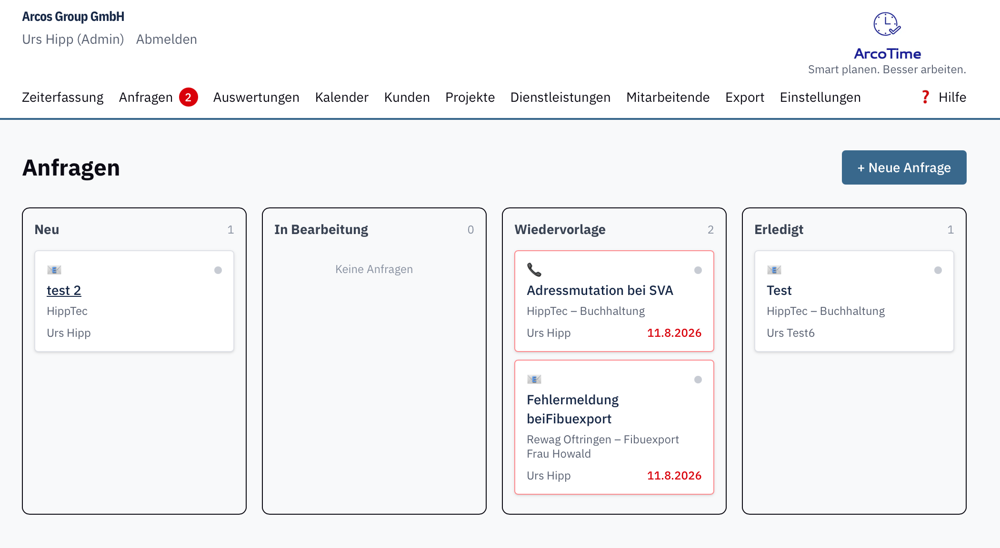
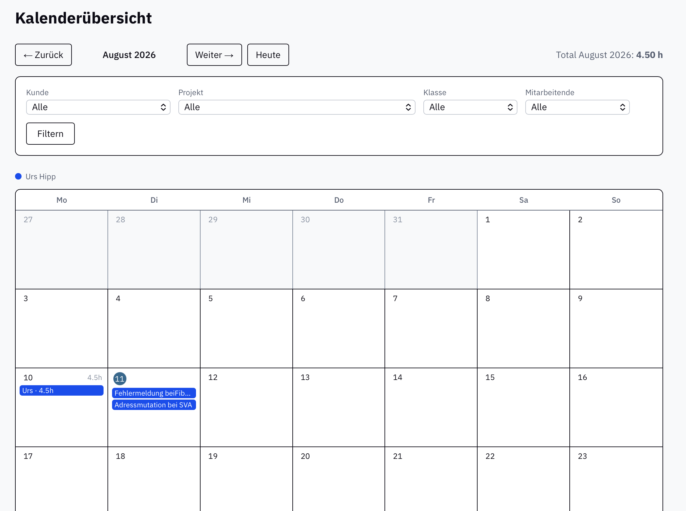

{width=1.35in}

# ArcoTime

*Smart planen. Besser arbeiten.*

---

Zeiterfassung, Aufträge, Arbeitsrapporte und Auswertungen in einer Anwendung – statt in drei getrennten Excel-Listen. Für Handwerk, Dienstleistung und KMU, die unterwegs arbeiten und den Überblick behalten wollen.

## Die Highlights

- **Zeiterfassung mit Timer** – manuell oder live per Timer. Er läuft auf dem Server weiter, auch bei geschlossenem Browser.
- **Arbeitsrapporte, die unterwegs genügen** – Einsatzadresse, Zugang („Schlüssel Nr. 4 im Kasten links"), Ansprechperson und alle Beteiligten mit anklickbarer Nummer. Auf dem Bildschirm und auf Papier.
- **Ein Kunde, mehrere Adressen** – Liegenschaft, Filiale, Baustelle. Mit eigener Anfahrt, eigenem Zugang und eigenen Beteiligten: Eigentümer, Verwaltung, Hauswart, Architekt.
- **Arbeit und Material in einer Liste** – Stunden, Kilometer, Spesen, Material. Preise, Rabatte und Mehrwertsteuer werden beim Erfassen eingefroren; eine späte Preisänderung verändert nichts Altes.
- **Navigation und Anruf mit einem Tipp** – zur richtigen Adresse, nicht zur Rechnungsadresse der Verwaltung.
- **Ihre Wörter, nicht unsere** – aus dem Projekt wird ein Auftrag, aus der Anfrage ein Ticket, aus dem Standort eine Liegenschaft. Einzahl, Mehrzahl und Artikel stellen Sie selbst ein; Branchenvorlagen setzen alles auf einmal.
- **Anfragen als Board** – vom Erstkontakt bis zum erledigten Auftrag, per Drag & Drop. Fällige Wiedervorlagen melden sich selbst.
- **Auswertungen, die rechnen** – nach Auftrag, nach Artikelklasse und nach Einsatzort, mit Menge und Betrag. Eine Zahl, die keinen Sinn ergibt, wird nicht gezeigt.
- **Export für die Buchhaltung** – ein Klick, im passenden Format, mit automatischer Belegnummer.
- **Auf dem Telefon dasselbe** – kein reduzierter Umfang, nur eine andere Anordnung: Der Tag zuoberst, Navigation und Anruf in Daumenreichweite.
- **Mandantenfähig und sicher** – jede Organisation sieht ausschliesslich ihre eigenen Daten. Server in der Schweiz, tägliche Sicherung, vollständiger Datenexport jederzeit.
- **Hilfe in der Anwendung** – mit Stichwortsuche, zum Thema passend, druckbar.

**Ab CHF 11.– bis CHF 15.– pro Monat und Benutzer**

gestaffelt nach Anzahl Lizenzen, exkl. MWST · 30 Tage kostenlos testen

## So sieht es aus

{width=3.1in}

{width=3.1in}

## Interesse geweckt?

> Wir zeigen Ihnen gerne unverbindlich, wie ArcoTime für Ihren Betrieb passt.
>
> **[Name Ansprechpartner:in]** · [Telefonnummer] · [E-Mail-Adresse]
>
> Oder direkt online registrieren und 30 Tage kostenlos testen: **arcotime.ch/registrieren**

{width=2.29in}
